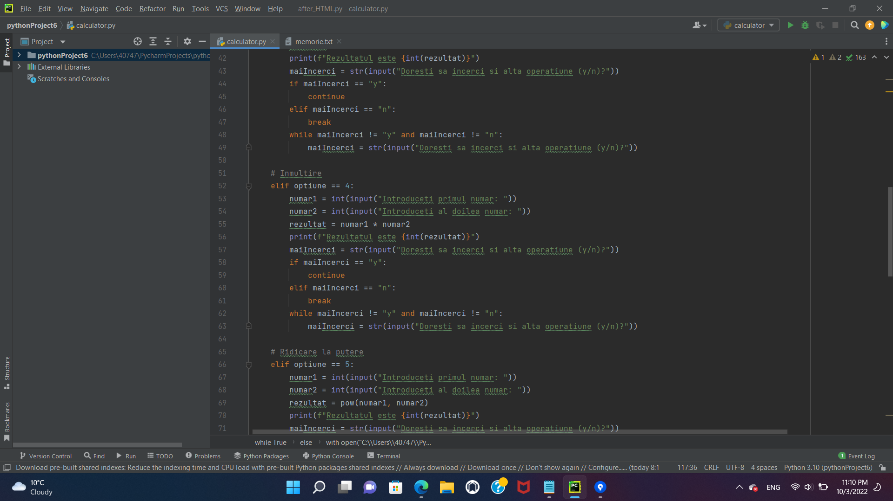
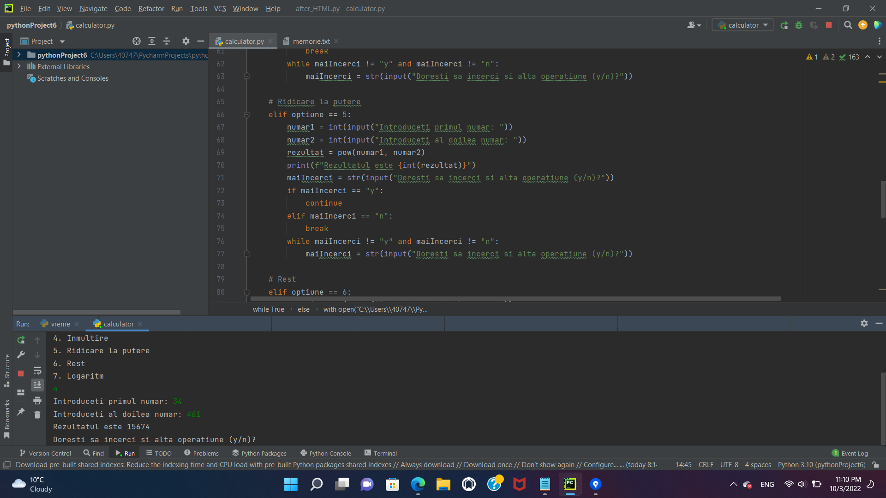

# Proiect Calculator

## Despre proiect
Am creat un mini calculator pentru a servi la adunarea, scaderea, inmultirea numerelor introduse, dar si alte operatiuni.

## Tehnologiile folosite
* Python

## Cateva imagini din culisele proiectului

